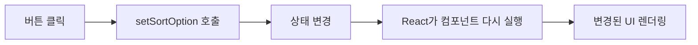

# MyCryptoDiary Day 1-4 프론트엔드 학습 정리

## 현재까지 구현한 것

- Next.js App Router 기반 페이지 라우팅
- 다크모드 대시보드 UI
- 거래 일기 Mock 데이터와 타입
- 거래 일기 목록 렌더링
- 누적 손익, 거래 수, 승률 계산
- 일자, 종목, 시가총액, PnL 정렬
- 거래 상세 페이지와 새 기록 페이지 이동
- `DiarySummary`, `DiaryList` 컴포넌트 분리
- 마켓 코인 Mock 데이터 작성

## 기술별 역할

| 기술 | 역할 |
| --- | --- |
| HTML | 화면의 구조와 요소를 정의한다. |
| CSS | 크기, 배치, 색상, 여백 등 모양을 만든다. |
| JavaScript | 데이터 처리와 프로그램 동작을 담당한다. |
| TypeScript | JavaScript 값의 타입을 검사한다. |
| JSX | JavaScript 안에서 UI 구조를 표현한다. |
| React | 컴포넌트를 렌더링하고 상태 변화를 화면에 반영한다. |
| Next.js | 라우팅, 서버 렌더링, 서버/클라이언트 실행 환경을 제공한다. |
| Tailwind CSS | CSS 스타일을 짧은 utility class로 작성하게 해준다. |

```text
TypeScript  타입 오류 검사
JSX         UI 구조 표현
React       컴포넌트 렌더링과 상태 변화 처리
Next.js     라우팅과 실행 환경 제공
Tailwind    CSS 스타일 작성
Browser     최종 HTML, CSS, JavaScript 실행
```

## SwiftUI와 비교

| Web / React | Swift / SwiftUI |
| --- | --- |
| TypeScript object type | Swift `struct` |
| TypeScript union type | Swift `enum`과 비슷한 제한된 값 |
| React component | SwiftUI `View` |
| props | View initializer로 전달하는 값 |
| `useState` | `@State` |
| `map()`으로 JSX 생성 | `ForEach` |
| `<button>` | SwiftUI `Button` |
| `onClick` | `Button` action closure |
| React `key` | `ForEach(..., id:)` |
| Next.js `Link` | `NavigationLink` |
| Tailwind class | SwiftUI style/layout modifier와 비슷한 역할 |

> [!NOTE]
> 역할이 비슷하다는 뜻이며 내부 구현이 완전히 같은 것은 아니다.

## HTML

### 요소와 중첩

HTML 요소는 네모난 상자로 생각한다.

```html
<section>
  <div>
    <p>내용</p>
  </div>
</section>
```

```text
section
└── div
    └── p
```

여는 태그와 닫는 태그는 반드시 짝을 이뤄야 한다.

```html
<div>
  내용
</div>
```

### 사용한 시맨틱 요소

- `<main>`: 페이지의 핵심 콘텐츠
- `<header>`: 페이지 또는 영역의 상단
- `<nav>`: 내비게이션 링크
- `<section>`: 의미 있는 콘텐츠 영역
- `<article>`: 독립적으로 이해 가능한 콘텐츠
- `<button>`: 사용자 명령을 실행하는 HTML 기본 버튼

### 기본 HTML 요소와 React 컴포넌트 구분

```tsx
<button /> // 소문자: HTML 기본 요소
<Button /> // 대문자: React 컴포넌트
<Link />   // 대문자: Next.js 컴포넌트
```

## CSS와 Tailwind CSS

### Box Model

```text
margin
└── border
    └── padding
        └── content
```

- `margin`: 요소 바깥쪽 여백
- `border`: 요소의 테두리
- `padding`: 요소 안쪽 여백
- `content`: 실제 내용
- `gap`: flex 또는 grid 자식 사이의 간격

### Flexbox

```tsx
<div className="mt-1 flex items-end gap-2">
  <p>52.1%</p>
  <p>+0.8%</p>
</div>
```

일반 CSS로 보면 다음과 비슷하다.

```css
div {
  margin-top: 4px;
  display: flex;
  align-items: flex-end;
  gap: 8px;
}
```

주요 클래스:

| Tailwind | 의미 |
| --- | --- |
| `flex` | 자식 요소를 기본적으로 가로로 배치 |
| `flex-col` | 자식 요소를 세로로 배치 |
| `items-center` | 교차축 가운데 정렬 |
| `items-end` | 교차축 끝 정렬 |
| `justify-between` | 주축의 남는 공간을 자식 사이에 배치 |
| `gap-2` | 자식 사이 간격 8px |
| `mt-1` | 위쪽 margin 4px |
| `p-4` | 모든 방향 padding 16px |
| `px-4` | 좌우 padding 16px |
| `py-2` | 상하 padding 8px |

### Grid

```tsx
<div className="grid grid-cols-3">
```

컨테이너를 같은 너비의 세 열로 나눈다.

### 위치와 크기

```text
fixed     화면을 스크롤해도 같은 위치 유지
right-8   오른쪽에서 32px
bottom-8  아래쪽에서 32px
size-14   width와 height를 56px로 지정
```

### Tailwind 임의 값

```tsx
bg-[#070a0f]
text-[28px]
h-[176px]
```

대괄호 안에 디자인에서 정한 정확한 값을 넣을 수 있다.

### className과 inline style

Tailwind class를 사용한 방식:

```tsx
<div className="mt-1 flex gap-2" />
```

inline style 방식:

```tsx
<div style={{ marginTop: '4px', display: 'flex', gap: '8px' }} />
```

현재 프로젝트는 Tailwind class를 중심으로 스타일링한다.

## JavaScript

### 객체와 배열

```ts
const diary = {
  id: 'btc-1',
  name: '비트코인',
  pnl: 124050,
};
```

```ts
const diaries = [diary1, diary2, diary3];
```

### 배열 함수

| 함수 | 역할 | 프로젝트에서 사용한 곳 |
| --- | --- | --- |
| `map()` | 각 데이터를 다른 형태로 변환 | 데이터로 JSX 목록 생성 |
| `filter()` | 조건을 만족하는 데이터만 선택 | 수익 거래 선택 |
| `reduce()` | 여러 값을 하나로 합침 | 누적 PnL 계산 |
| `sort()` | 배열 순서 변경 | 일자, 종목, 시총, PnL 정렬 |

#### map

```tsx
diaries.map((diary) => (
  <p key={diary.id}>{diary.name}</p>
));
```

SwiftUI의 `ForEach`와 비슷한 역할로 사용할 수 있다.

#### filter

```ts
const winningTrades = diaries.filter((diary) => diary.pnl > 0).length;
```

수익이 0보다 큰 거래만 선택한 뒤 개수를 구한다.

#### reduce

```ts
const totalPnl = diaries.reduce(
  (sum, diary) => sum + diary.pnl,
  0,
);
```

`0`부터 시작해 모든 거래의 PnL을 더한다.

#### sort와 불변성

```ts
const sortedDiaries = [...diaries].sort((a, b) => b.pnl - a.pnl);
```

JavaScript의 `sort()`는 원본 배열을 변경한다. React props를 직접 변경하지 않기 위해 spread syntax로 배열을 복사한 후 정렬한다.

```ts
[...diaries]
```

Swift의 `sorted()`가 새 배열을 반환하는 것과 차이가 있다.

### 삼항 연산자

```tsx
diary.pnl >= 0 ? '수익 색상' : '손실 색상'
```

```text
조건 ? 참일 때 값 : 거짓일 때 값
```

### 템플릿 문자열

```tsx
href={`/diary/${diary.id}`}
```

문자열 안에 JavaScript 값을 넣을 때 `${...}`를 사용한다.

## TypeScript

### Object Type

```ts
export type Diary = {
  id: string;
  symbol: string;
  name: string;
  pnl: number;
};
```

Swift의 `struct`와 비슷하게 데이터의 형태를 정의한다.

### Union Type

```ts
type SortOption = 'date' | 'name' | 'marketCap' | 'pnl';
```

정렬 기준으로 네 값만 사용할 수 있도록 제한한다. Swift의 enum과 비슷한 역할이다.

### Array Type

```ts
Diary[]
Coin[]
```

Swift의 `[Diary]`, `[Coin]`과 비슷하다.

### Props Type

```ts
type DiarySummaryProps = {
  totalPnl: number;
  totalTrades: number;
  winRate: number;
};
```

컴포넌트가 부모로부터 어떤 값을 받아야 하는지 정의한다.

### Type-only Import

```ts
import type { Diary } from '@/data/diary/diaries';
```

실행 시 필요한 값이 아니라 TypeScript 검사에만 필요한 타입을 가져온다.

## JSX와 React

### JSX

```tsx
<p>{diary.name}</p>
```

JSX에서 JavaScript 값은 중괄호 안에 작성한다.

```tsx
{diary.pnl.toLocaleString()}원
```

JSX는 브라우저가 직접 이해하지 않는다. 빌드 과정에서 React 요소를 생성하는 JavaScript로 변환된다.

### 함수 컴포넌트

```tsx
export default function DiaryList({ diaries }: DiaryListProps) {
  return <div>...</div>;
}
```

React 컴포넌트는 JSX를 반환하는 함수다. SwiftUI의 작은 `View`로 생각할 수 있다.

### 컴포넌트 합성

```tsx
<DiarySummary
  totalPnl={totalPnl}
  totalTrades={diaries.length}
  winRate={winRate}
/>

<DiaryList diaries={diaries} />
```

큰 화면을 작은 컴포넌트로 분리하면 태그 중첩과 책임이 줄어든다.

### Props

Props는 부모 컴포넌트가 자식 컴포넌트에 전달하는 읽기 전용 입력값이다.

```text
HomePage
   │
   ├── totalPnl
   ├── totalTrades
   └── winRate
          ↓
   DiarySummary
```

SwiftUI View의 initializer 파라미터와 비슷하다.

### key

```tsx
key={diary.id}
```

`key`는 화면에 보이는 제목이 아니다. React가 반복되는 요소를 안정적으로 구분하기 위한 내부 식별자다.

SwiftUI의 다음 코드와 비슷하다.

```swift
ForEach(diaries, id: \.id)
```

### State

```tsx
const [sortOption, setSortOption] = useState<SortOption>('date');
```

SwiftUI와 비교:

```swift
@State private var sortOption: SortOption = .date
```

```text
sortOption     현재 상태값
setSortOption  상태를 변경하는 함수
'date'         최초 상태값
```

상태 변경 흐름:



일반 변수와 달리 state가 바뀌면 React가 화면을 다시 렌더링한다.

### 이벤트

```tsx
onClick={() => setSortOption(option.value)}
```

SwiftUI와 비교:

```swift
Button {
    sortOption = option.value
} label: {
    Text(option.label)
}
```

화살표 함수는 클릭했을 때 코드를 실행하도록 전달한다.

### 조건부 스타일

```tsx
className={
  sortOption === option.value
    ? '선택된 버튼 스타일'
    : '선택되지 않은 버튼 스타일'
}
```

현재 state와 버튼의 value가 같은지 비교해 스타일을 결정한다.

## 정렬 옵션 구조

```ts
const sortOptions = [
  { label: '일자', value: 'date' },
  { label: '종목', value: 'name' },
  { label: '시총', value: 'marketCap' },
  { label: 'PnL', value: 'pnl' },
];
```

- `label`: 사용자에게 보여주는 문자열
- `value`: 코드가 정렬 방식을 구분하기 위한 값

```text
화면 표시       내부 값
일자            date
종목            name
시총            marketCap
PnL             pnl
```

`sortOption`은 실제 정렬 결과가 아니라 현재 선택한 정렬 기준을 기억하는 state다.

## Next.js

### App Router와 파일 기반 라우팅

```text
app/page.tsx                 → /
app/market/page.tsx          → /market
app/diary/new/page.tsx       → /diary/new
app/diary/[id]/page.tsx      → /diary/btc-1
app/currency/[symbol]/page   → /currency/BTC
```

대괄호가 포함된 폴더는 동적 경로다.

### Link

```tsx
<Link href="/market">마켓</Link>
```

Next.js의 페이지 이동 컴포넌트다. SwiftUI의 `NavigationLink`와 비슷한 역할이다.

### Server Component와 Client Component

Next.js App Router의 컴포넌트는 기본적으로 Server Component다.

`useState`, `onClick`처럼 브라우저 상호작용이 필요하면 파일 첫 줄에 다음을 사용한다.

```tsx
'use client';
```

이 선언은 해당 파일을 Client Component 경계로 만든다.

## 데이터와 UI 분리

Mock 데이터는 페이지와 분리했다.

```text
src
├── app
│   ├── page.tsx
│   └── market/page.tsx
├── components
│   └── home
│       ├── DiaryList.tsx
│       └── DiarySummary.tsx
└── data
    ├── diary/diaries.ts
    └── market/coin.ts
```

이 구조의 장점:

- UI와 데이터 책임이 분리된다.
- Mock 데이터를 API 응답으로 교체하기 쉽다.
- 컴포넌트를 테스트하기 쉬워진다.
- 파일 하나의 태그 중첩과 길이가 줄어든다.

## Mock 데이터에서 API로 가는 흐름

```text
1. Mock 데이터로 UI 구조 구현
2. 배열과 타입을 컴포넌트에 연결
3. 로딩 상태와 에러 상태 구현
4. fetch로 실제 API 요청
5. API 응답을 화면용 타입으로 변환
6. 실시간 가격은 WebSocket으로 갱신
```

## 개발 도구와 검증

### ESLint

```bash
npm run lint
```

문법, 규칙 위반, 일부 실수를 검사한다. Tailwind class 철자 오류까지 모두 찾지는 못한다.

### Production Build

```bash
npm run build
```

Next.js 프로덕션 빌드, TypeScript 검사, 페이지 생성 가능 여부를 확인한다.

### 코드 자동 정렬

VS Code macOS 기준:

```text
Shift + Option + F
```

들여쓰기가 어긋났을 때 먼저 자동 정렬한 후 태그 중첩을 확인한다.

## 공식 문서에서 찾아볼 키워드

### MDN HTML

- HTML element
- HTML nesting
- semantic HTML
- HTML button element
- HTML anchor element

### MDN CSS

- CSS Box Model
- CSS Flexbox
- CSS Grid
- CSS position fixed
- CSS margin padding gap

### MDN JavaScript

- JavaScript object
- JavaScript array
- Arrow functions
- Array map
- Array filter
- Array reduce
- Array sort
- Spread syntax
- Template literals
- Ternary operator

### TypeScript Handbook

- Everyday Types
- Object Types
- Type Aliases
- Union Types
- Array Types
- Type-only imports

### React 공식 문서

- Writing Markup with JSX
- JavaScript in JSX with Curly Braces
- Your First Component
- Passing Props to a Component
- Conditional Rendering
- Rendering Lists
- Responding to Events
- State: A Component's Memory
- Render and Commit
- Keeping Components Pure

### Next.js 공식 문서

- App Router
- Pages and Layouts
- Dynamic Routes
- Link Component
- Server and Client Components
- use client

### Tailwind CSS 공식 문서

- Utility-first fundamentals
- Spacing
- Flexbox
- Grid
- Sizing
- Colors
- Borders
- Hover focus states
- Arbitrary values

## 복습 질문

- [ ] HTML 여는 태그와 닫는 태그의 부모-자식 구조를 설명할 수 있는가?
- [ ] `margin`, `padding`, `gap`의 차이를 설명할 수 있는가?
- [ ] Flexbox의 `justify-*`와 `items-*` 차이를 설명할 수 있는가?
- [ ] `map`, `filter`, `reduce`, `sort`가 각각 무엇을 반환하는지 설명할 수 있는가?
- [ ] `sort()` 전에 배열을 복사한 이유를 설명할 수 있는가?
- [ ] TypeScript object type과 union type을 설명할 수 있는가?
- [ ] JSX와 React의 차이를 설명할 수 있는가?
- [ ] props와 state의 차이를 설명할 수 있는가?
- [ ] 일반 변수 대신 state가 필요한 이유를 설명할 수 있는가?
- [ ] React 목록에서 `key`가 필요한 이유를 설명할 수 있는가?
- [ ] 소문자 `<button>`과 대문자 `<Button>`의 차이를 설명할 수 있는가?
- [ ] `'use client'`가 필요한 경우를 설명할 수 있는가?
- [ ] Next.js 동적 라우트 `[id]`의 역할을 설명할 수 있는가?
- [ ] Mock 데이터를 실제 API 데이터로 교체하는 흐름을 설명할 수 있는가?

## 다음 학습

Day 4에서 추가로 다룰 내용:

- 현물/선물 segmented control
- 코인 목록 컴포넌트
- 가격, 시가총액, 24시간 변동률 정렬
- 실시간 가격 상태 업데이트
- 가격 변경 flash animation
- Currency Detail 동적 페이지 이동

